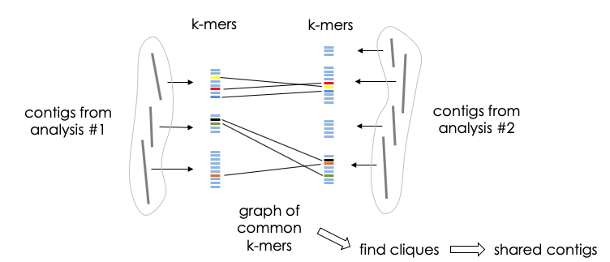

# clique-based-inter-events

Exhaustive capture of biological variation in RNA-seq data through k-mer decomposition (article: https://doi.org/10.1186/s13059-017-1372-2, pre-print: http://biorxiv.org/content/early/2017/06/02/122937).

DE-kupl is a computational protocol that aims to capture all k-mer variation in an input set of RNA-seq libraries. To verify the replicability of DE-kupl, we developed this pipeline to compare the consistency of events between different cohorts. One lung cancer data is downloaded from the TCGA database (https://portal.gdc.cancer.gov/projects/TCGA-LUAD), which consists of 58 normal samples and 524 tumor samples. The other lung cancer data is downloaded from the SRA database (https://www.ncbi.nlm.nih.gov/sra?term=ERP001058), which consists of 77  paired normal and tumor samples.


## Dependencies

The Detector relies on the following python libraries: 

- **[numpy](https://www.numpy.org/)** NumPy is the fundamental package for scientific computing with Python. 
- **[pandas](https://www.pandas.org/)** Pandas is a python library that allows you to easily manipulate data to analyze. 
- **[networkx](https://networkx.github.io/)** NetworkX is a Python package for the creation, manipulation, and study of the structure, dynamics, and functions of complex networks.
- **[biopython](https://biopython.org/)** Biopython is a set of freely available tools for biological computation written in Python by an international team of developers.

## Basic usage

- **Step 1: Run dekupl-run**. We first activate the conda environement where dekupl-run was installed, then we run the software. The description of parameters can be found from the repository of DEkupl (https://github.com/Transipedia/dekupl-run)
    ```
    conda install -n dekupl -c transipedia dekupl-run dekupl-annotation 
    source activate dekupl
    dekupl-run --configfile my-config.json  -jNB_THREADS --resources ram=MAX_MEMORY -p
    ``` 


- **Step 2: Run dekupl-annotation**. Then we ran DEkupl annotation on the output results from both two datasets. The reference files include the Genome sequence (GRCh38.p12) and annotation file (version 31). The main output files are the DiffContigInfo.tsv which include the annotation information of each contig.The description of parameters can be found from the repository of DEkupl (https://github.com/Transipedia/dekupl-annotation)
    ```
    source activate dekupl
    dkpl index -g toy/references/GRCh38-chr22.fa.gz -a toy/references/GRCh38-chr22.gff.gz -i test_index
    dkpl annot -i test_index toy/dkpl-run/merged-diff-counts.tsv.gz
    ```

- **Step 3: Extract shared events**. We run this pipeline using the DEkupl annotation outputs from two datasets as input. Then we can compare the consistency between two datasets from contig's level.
    ```
    cd bin;g++ interSeqGraph.cpp -o interSeqGraph
    python3 clique_based_interevents.py DiffContig_cohort1 DiffContig_cohort2 outdir kmer_size
    ```
## Input

- Table `DiffContig_cohort1/2`, summarizing for each contig, which is the DEkupl annotation output of dataset1/2.

- Path `outdir`, the output directory 

- Integer `kmer_size`, length of kmers


## Output files

- Table  `shared_contigs_dataset.tsv`, the table containing all shared events and corresponding annotation data from each dataset. 
- Table  `shared_events.tsv`, the table containing all pairwise shared contigs between two datasets.
